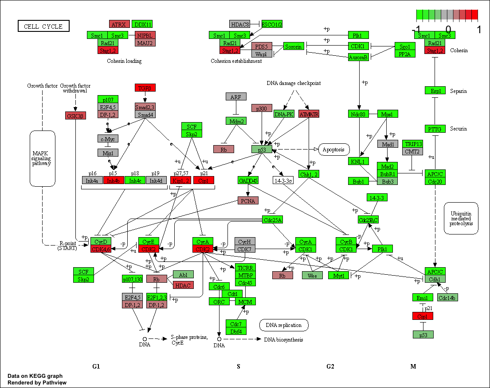
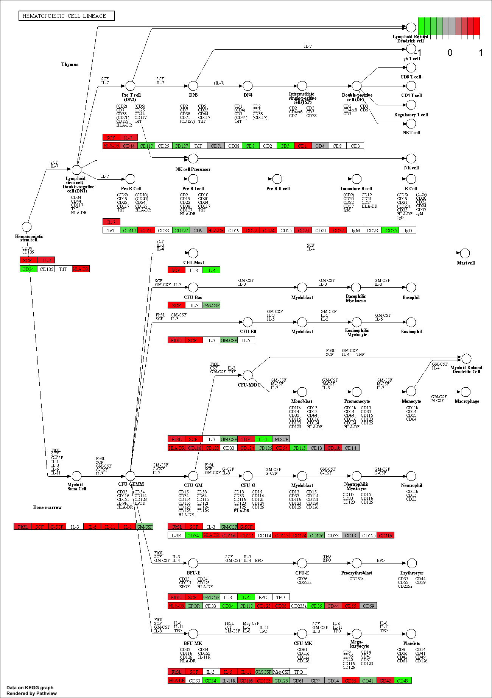
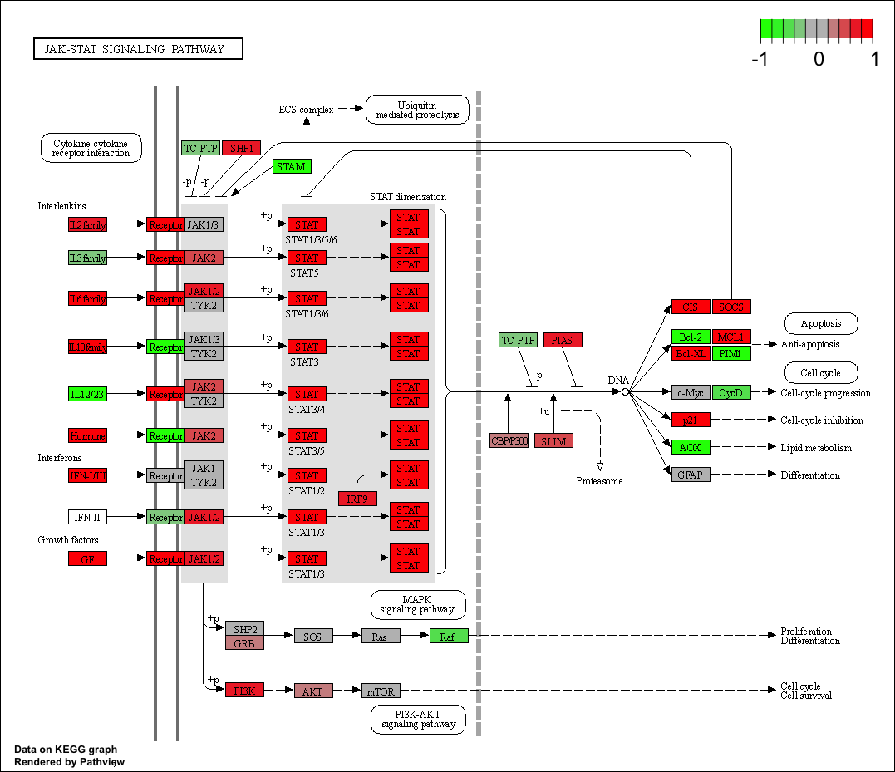
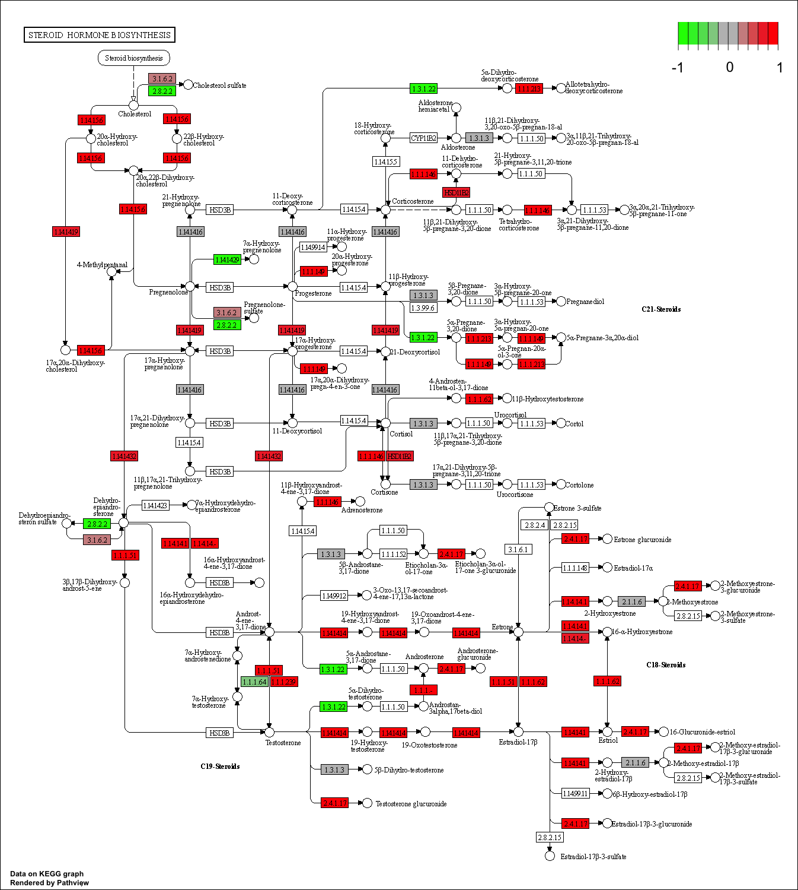
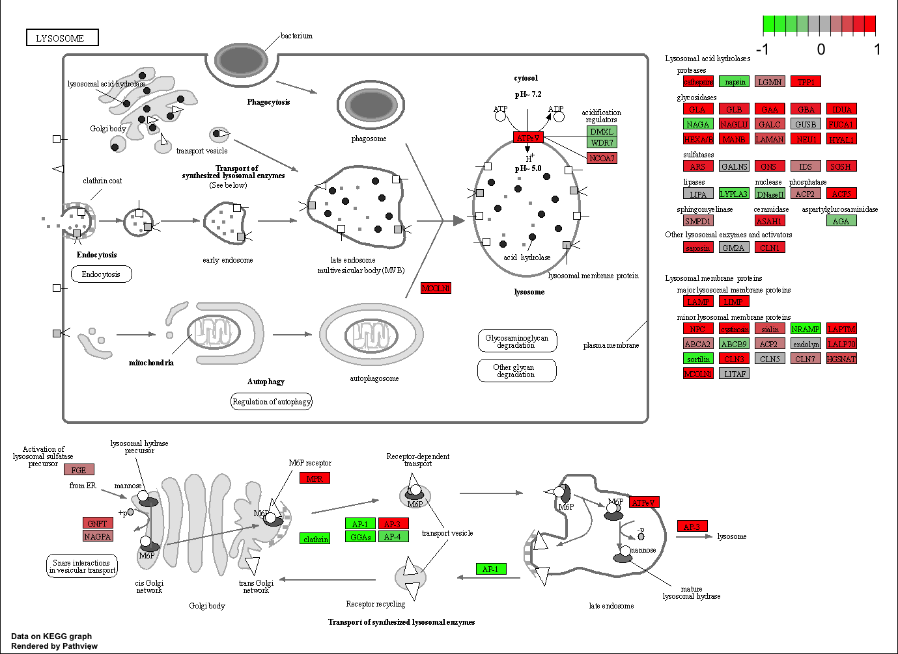
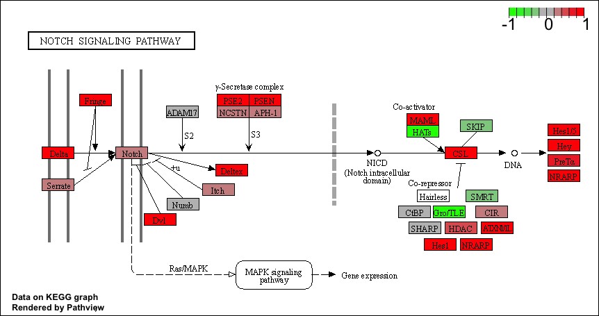
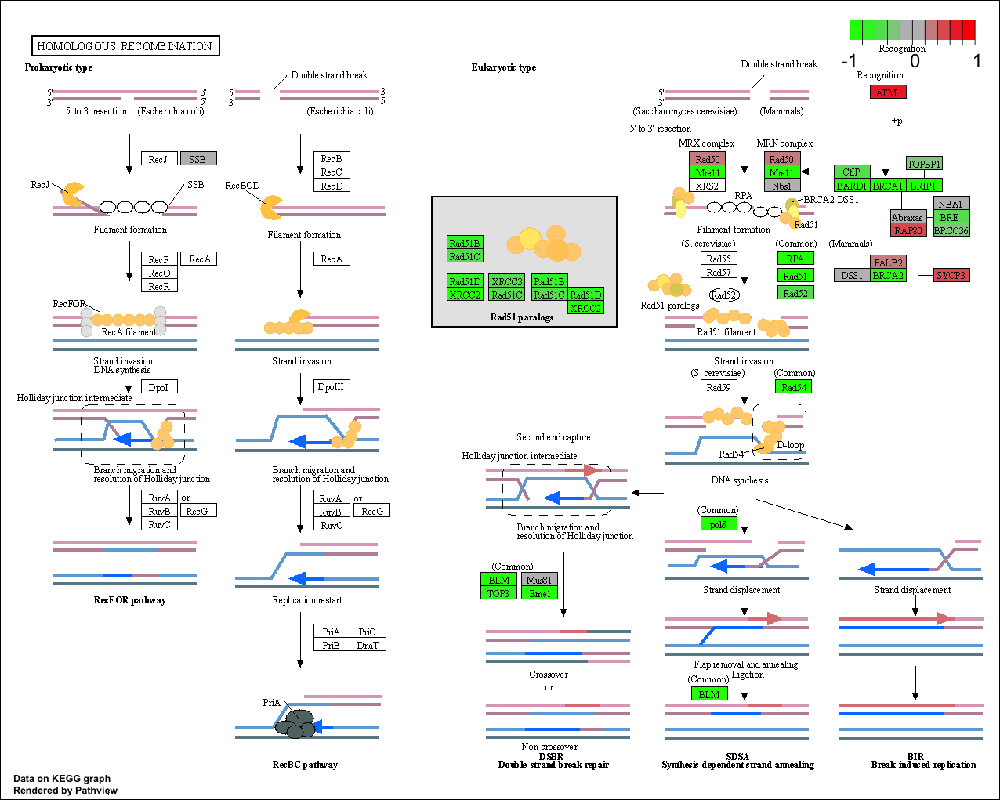

# Section 1. Differential Expression Analysis

```{r}
library(DESeq2)
```

Importing the `metadata`:

```{r}
metaFile <- "GSE37704_metadata.csv"
countFile <- "GSE37704_featurecounts.csv"

colData = read.csv(metaFile, row.names=1)
head(colData)
```

Importing the `countdata`:

```{r}
countData = read.csv(countFile, row.names=1)
head(countData)
```

**Q1**. Complete the code below to remove the troublesome first column from `countData`

```{r}
countData <- as.matrix(countData[,-1])
head(countData)
```

**Q2**. Complete the code below to filter `countData` to exclude genes (i.e. rows) where we have 0 read count across all samples (i.e. columns).

```{r}
countData = countData[rowSums(countData[])>0,]
head(countData)
```

## Running DESeq2

Setting up DESeq:

```{r}
dds = DESeqDataSetFromMatrix(countData=countData,
                             colData=colData,
                             design=~condition)
```

```{r}
dds = DESeq(dds)
```

```{r}
dds
```

Getting results for the HoxA1 Knockdown vs Control siRNA:

```{r}
res = results(dds, contrast=c("condition", "hoxa1_kd", "control_sirna"))
```

```{r}
res
```

**Q3**. Call the **summary()** function on your results to get a sense of how many genes are up or down-regulated at the default 0.1 p-value cutoff.

```{r}
summary(res)
```

## Volcano Plot

```{r}
plot( res$log2FoldChange, -log(res$padj) )
```

**Q4**. Improve this plot by completing the below code, which adds color and axis labels

```{r}
mycols <- rep("gray", nrow(res) )
mycols[ abs(res$log2FoldChange) > 2 ] <- "red"
inds <- (res$pvalue < 0.01) & (abs(res$log2FoldChange) > 2 )
mycols[ inds ] <- "blue"
plot( res$log2FoldChange, -log(res$padj), col=mycols, xlab="Log2(FoldChange)", ylab="-Log(P-value)" )
```

## Adding Gene Annotation

**Q5**. Use the **mapIDs()** function multiple times to add SYMBOL, ENTREZID and GENENAME annotation to our results by completing the code below.

```{r}
library("AnnotationDbi")
library("org.Hs.eg.db")

columns(org.Hs.eg.db)

res$symbol = mapIds(org.Hs.eg.db,
                    keys=row.names(res), 
                    keytype="ENSEMBL",
                    column="SYMBOL",
                    multiVals="first")

res$entrez = mapIds(org.Hs.eg.db,
                    keys=row.names(res),
                    keytype="ENSEMBL",
                    column="ENTREZID",
                    multiVals="first")

res$name =   mapIds(org.Hs.eg.db,
                    keys=row.names(res),
                    keytype="ENSEMBL",
                    column="GENENAME",
                    multiVals="first")

head(res, 10)
```

**Q6**. Finally for this section let's reorder these results by adjusted p-value and save them to a CSV file in your current project directory.

```{r}
res = res[order(res$pvalue),]
write.csv(res,file="deseq_results.csv")
```

# Section 2. Pathway Analysis

Installing packages:

```{r}
#BiocManager::install( c("pathview", "gage", "gageData") )
```

```{r}
library(pathview)
library(gage)
```

```{r}
library(gageData)
data(kegg.sets.hs)
data(sigmet.idx.hs)
kegg.sets.hs = kegg.sets.hs[sigmet.idx.hs]
head(kegg.sets.hs, 3)
```

```{r}
foldchanges = res$log2FoldChange
names(foldchanges) = res$entrez
head(foldchanges)
```

Running **gage** pathway analysis:

```{r}
keggres = gage(foldchanges, gsets=kegg.sets.hs)
```

```{r}
attributes(keggres)
```

```{r}
head(keggres$less)
```

Trying out `pathview()`:

```{r}
pathview(gene.data=foldchanges, pathway.id="hsa04110")
```



```{r}
pathview(gene.data=foldchanges, pathway.id="hsa04110", kegg.native=FALSE)
```


```{r}
keggrespathways <- rownames(keggres$greater)[1:5]
keggresids = substr(keggrespathways, start=1, stop=8)
keggresids
```

```{r}
pathview(gene.data=foldchanges, pathway.id=keggresids, species="hsa")
```











**Q7**. Can you do the same procedure as above to plot the pathview figures for the top 5 down-reguled pathways?

```{r}
keggrespathways1 <- rownames(keggres$less)[1:5]
keggresids1 = substr(keggrespathways1, start=1, stop=8)
keggresids1
pathview(gene.data=foldchanges, pathway.id=keggresids1, species="hsa")
```





# Section 3. Gene Ontology (GO)

```{r}
data(go.sets.hs)
data(go.subs.hs)
gobpsets = go.sets.hs[go.subs.hs$BP]
gobpres = gage(foldchanges, gsets=gobpsets, same.dir=TRUE)
lapply(gobpres, head)
```

# Section 4. Reactome Analysis

```{r}
sig_genes <- res[res$padj <= 0.05 & !is.na(res$padj), "symbol"]
print(paste("Total number of significant genes:", length(sig_genes)))
```

```{r}
write.table(sig_genes, file="significant_genes.txt", row.names=FALSE, col.names=FALSE, quote=FALSE)
```

**Q8**: What pathway has the most significant \"Entities p-value\"? Do the most significant pathways listed match your previous KEGG results? What factors could cause differences between the two methods?


Cell Cycle, Mitotic is the pathway with the most significant \"Entities p-value\". These do not exactly match the listed match your previous KEGG results. Factors could cause differences between the two methods are that the KEGG database is rarely updated unlike the reactome website.
